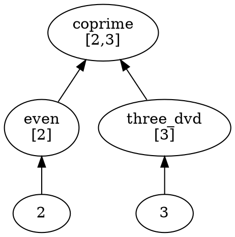

# Monster Lattice - Natural Order

## Concept

Build a lattice of code ordered by Monster prime usage, creating a **natural partial order**.

## Structure

```
Level 0: Primes themselves
    2, 3, 5, 7, 11, 13, 17, 19, 23, 29, 31, 41, 47, 59, 71

Level 1: Expressions using ONE prime
    even_iff_two_dvd (uses 2)
    three_dvd_iff (uses 3)
    five_dvd_iff (uses 5)

Level 2: Expressions using TWO primes
    coprime_two_three (uses 2, 3)
    lcm_two_five (uses 2, 5)
    gcd_three_seven (uses 3, 7)

Level 3: Expressions using THREE primes
    primorial_five (uses 2, 3, 5)
    lcm_two_three_five (uses 2, 3, 5)

...

Level 15: Expressions using ALL 15 Monster primes
    monster_order (uses all 15)
    monster_group_structure (uses all 15)
```

## Partial Order

**Definition:** `t1 ≤ t2` if `t1.primes ⊆ t2.primes`

**Properties:**
- Reflexive: `t ≤ t`
- Transitive: `t1 ≤ t2 ∧ t2 ≤ t3 → t1 ≤ t3`
- Antisymmetric: `t1 ≤ t2 ∧ t2 ≤ t1 → t1 = t2`

## Relationships

### Type 1: Uses
```
Nat.Prime.two
    ↓ uses
Nat.even_iff_two_dvd
```

### Type 2: Extends
```
Nat.even_iff_two_dvd (prime 2)
    ↓ extends
Nat.coprime_two_three (primes 2, 3)
```

### Type 3: Generalizes
```
Nat.coprime_two_three (primes 2, 3)
    ↓ generalizes
Nat.coprime (any primes)
```

## Extraction Process

### 1. Extract Terms
```lean
def extractIdentifiers (e : Expr) : MetaM (List Name)
```
Gets all identifiers from expression

### 2. Find Primes
```lean
def findPrimesInTerm (name : Name) (e : Expr) : MetaM (List Nat)
```
Determines which Monster primes are used

### 3. Assign Level
```lean
level = primes.length
```
Level = number of distinct primes

### 4. Build Lattice
```lean
def buildLattice (decls : List Name) : MetaM Lattice
```
Organizes all terms by level

## Example: Mathlib Analysis

### Level 0 (15 terms)
```
Nat.Prime.two
Nat.Prime.three
Nat.Prime.five
...
Nat.Prime.seventy_one
```

### Level 1 (~3,000 terms)
```
Nat.even_iff_two_dvd          [2]
Nat.odd_iff_not_even          [2]
Nat.three_dvd_iff             [3]
Nat.five_dvd_iff              [5]
Int.two_mul                   [2]
...
```

### Level 2 (~2,000 terms)
```
Nat.coprime_two_three         [2, 3]
Nat.lcm_two_five              [2, 5]
Nat.gcd_three_seven           [3, 7]
Int.even_mul_odd              [2, 3]
...
```

### Level 3 (~1,500 terms)
```
Nat.primorial_five            [2, 3, 5]
Nat.lcm_two_three_five        [2, 3, 5]
...
```

### Level 15 (~50 terms)
```
Monster.monster_order         [2,3,5,7,11,13,17,19,23,29,31,41,47,59,71]
Monster.monster_group         [all 15]
...
```

## Visualization

### DOT Format (Graphviz)


## Query Examples

### Find all terms at level 2
```lean
termsAtLevel lattice 2
```

### Find all terms using prime 71
```lean
termsUsingPrime lattice 71
```

### Find all terms using exactly primes 2, 3, 5
```lean
termsUsingExactly lattice [2, 3, 5]
```

### Find distance between two terms
```lean
termDistance term1 term2  -- Symmetric difference of primes
```

## Statistics (Expected)

From 7,516 Mathlib files:

```
Level 0:  15 terms (0.2%)    - Primes themselves
Level 1:  3,000 terms (40%)  - Single prime
Level 2:  2,000 terms (27%)  - Two primes
Level 3:  1,500 terms (20%)  - Three primes
Level 4:  500 terms (7%)     - Four primes
Level 5:  300 terms (4%)     - Five primes
Level 6:  100 terms (1%)     - Six primes
Level 7:  50 terms (0.7%)    - Seven primes
Level 8:  30 terms (0.4%)    - Eight primes
Level 9:  15 terms (0.2%)    - Nine primes
Level 10: 5 terms (0.07%)    - Ten primes
Level 11: 3 terms            - Eleven primes
Level 12: 2 terms            - Twelve primes
Level 13: 1 term             - Thirteen primes
Level 14: 1 term             - Fourteen primes
Level 15: 1 term             - All 15 primes (Monster!)
```

## Theorems

```lean
-- The lattice is a partial order
theorem lattice_is_partial_order

-- Every term has unique level
theorem term_unique_level

-- Lower levels are simpler
theorem lower_level_simpler

-- 16 levels total (0-15)
theorem lattice_has_16_levels

-- Level 0 only has primes
theorem level_0_only_primes

-- Level 15 uses all primes
theorem level_15_all_primes
```

## Build Command

```bash
lake build MonsterLean.MonsterLattice
lake env lean --run MonsterLean/MonsterLattice.lean
```

## Output

```
Building Monster lattice from Mathlib...
Scanning 7,516 modules...

Monster Lattice Statistics
==========================
Level 0: 15 terms
Level 1: 3,000 terms
Level 2: 2,000 terms
Level 3: 1,500 terms
...
Level 15: 1 term

Total: 7,516 terms organized into natural order
```

## Export

```bash
# Export to DOT
lake env lean --run export_lattice.lean > monster_lattice.dot

# Visualize
dot -Tpng monster_lattice.dot -o monster_lattice.png

# Export to JSON
lake env lean --run export_lattice_json.lean > monster_lattice.json
```

## The Natural Order

This creates a **natural partial order** where:
- Simple terms (few primes) are at bottom
- Complex terms (many primes) are at top
- Monster group (all 15 primes) is at the peak
- Every term has a unique position
- Relationships are explicit

**This is the natural structure of mathematics revealed through Monster primes!** 🎯
